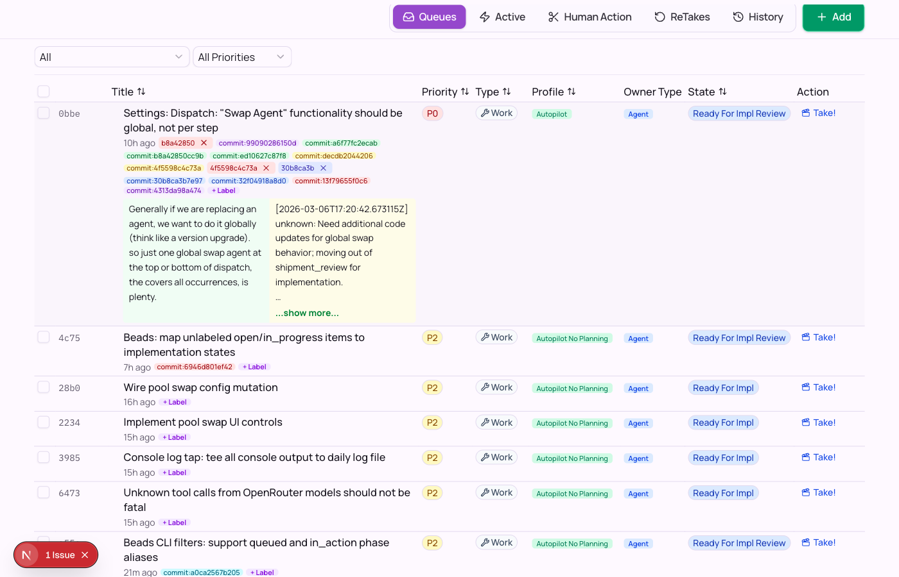
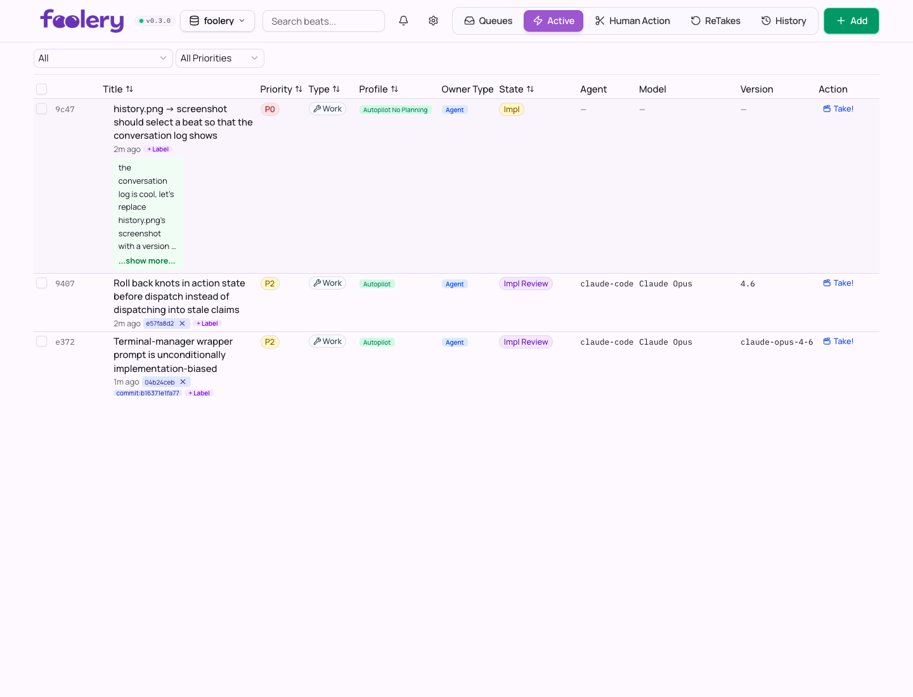
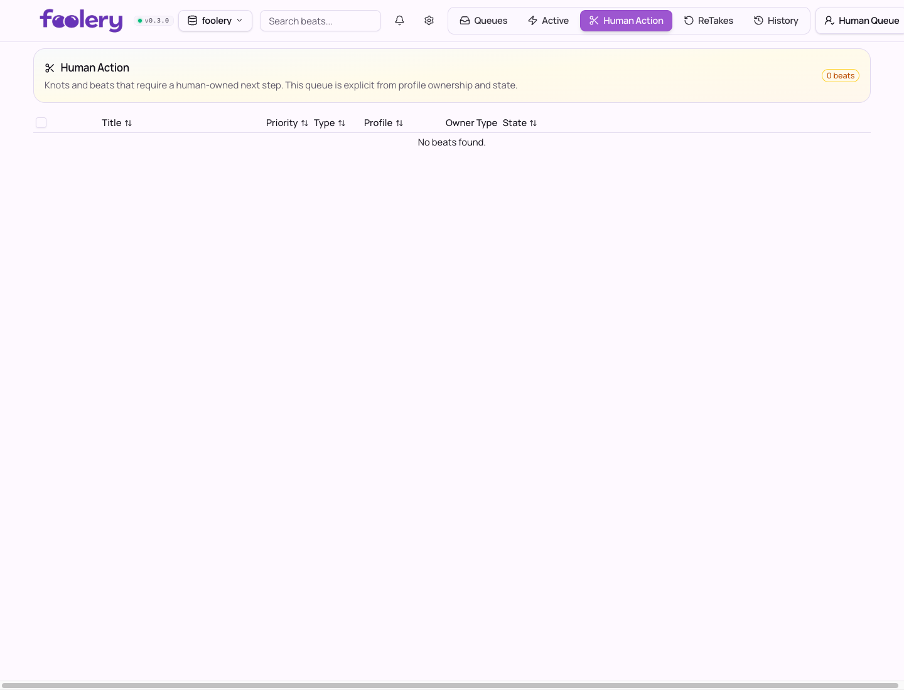
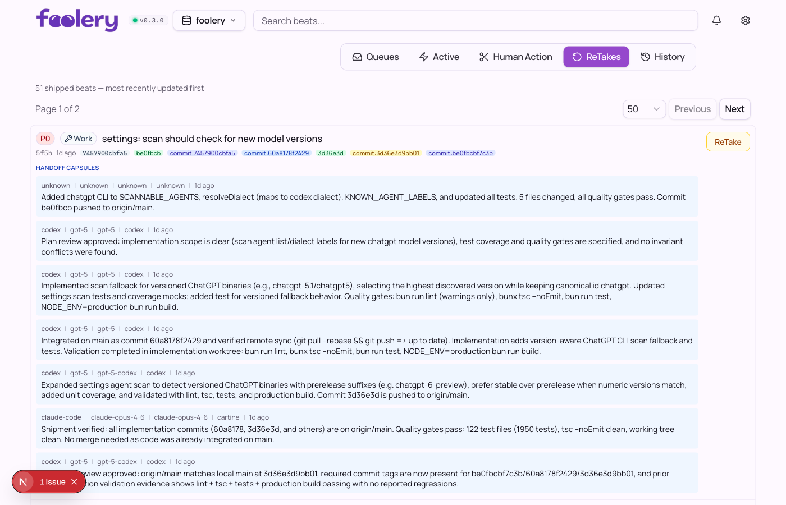
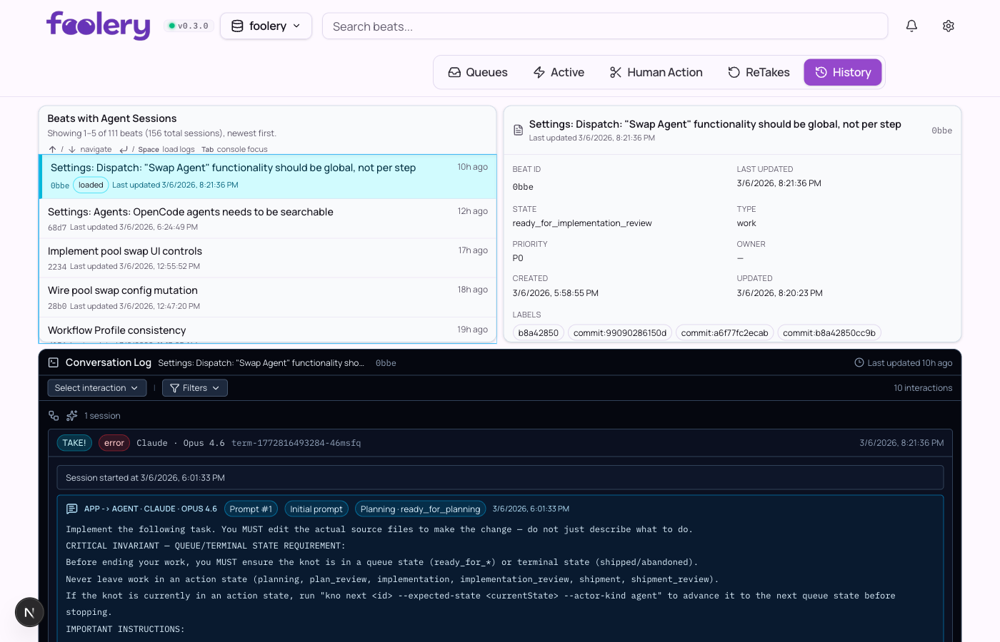
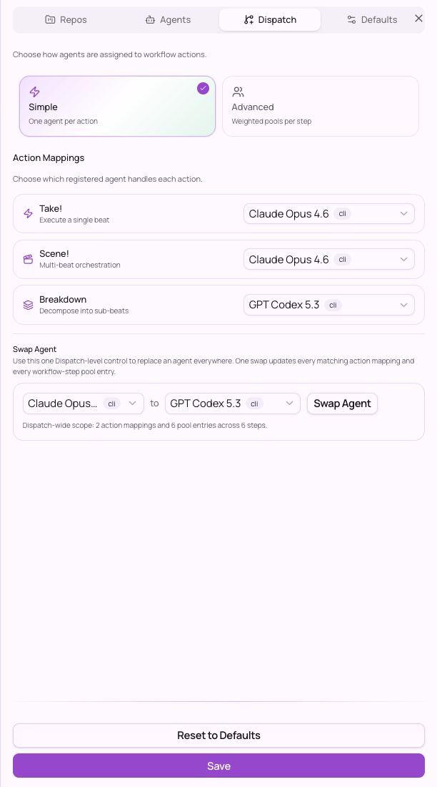
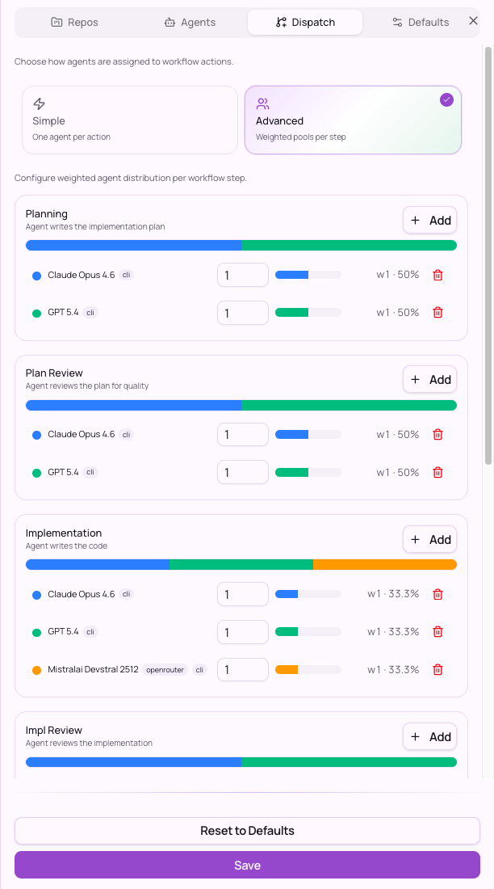

# Foolery

**A keyboard-first control room for multi-agent software work.**

Foolery helps you capture work, break it down, dispatch agents, review what they did, and keep the whole thing legible across repositories.

[](https://github.com/acartine/foolery/releases)
[](https://github.com/acartine/foolery/blob/main/LICENSE)
[](https://github.com/acartine/foolery/actions/workflows/coverage.yml)

<table align="center">
  <tr>
    <td align="center">
      <a href="docs/screenshots/queues.png">
        
      </a>
      <br />
      <sub><b>Queues</b></sub>
    </td>
    <td align="center">
      <a href="docs/screenshots/active.png">
        
      </a>
      <br />
      <sub><b>Active</b></sub>
    </td>
    <td align="center">
      <a href="docs/screenshots/human-action.png">
        
      </a>
      <br />
      <sub><b>Human Action</b></sub>
    </td>
  </tr>
  <tr>
    <td align="center">
      <a href="docs/screenshots/retakes.png">
        
      </a>
      <br />
      <sub><b>Retakes</b></sub>
    </td>
    <td align="center">
      <a href="docs/screenshots/history.png">
        
      </a>
      <br />
      <sub><b>History</b></sub>
    </td>
    <td align="center">
      <a href="docs/screenshots/hot-keys.png">
        
      </a>
      <br />
      <sub><b>Hot Keys</b></sub>
    </td>
  </tr>
</table>

Foolery is a local orchestration app for agent-driven software work. It sits on top of memory-manager backends — primarily [Knots](https://github.com/acartine/knots), with [Beads](https://github.com/steveyegge/beads) also supported — and gives you one place to stage work, run agents, and review outcomes across repos.

It is not trying to be just another chat box around a coding model. The point is to make multi-step work visible: what is queued, what is active, what needs a human, what is ready for review, and what happened in the session history.

[Read the Substack post on why I built it.](https://open.substack.com/pub/thecartine/p/foolery-the-app?r=1rb8nt&utm_campaign=post&utm_medium=web&showWelcomeOnShare=true)

## Install

### Prerequisites

You need:
- [Node.js](http://nodejs.org)
- [curl](http://curl.se)
- [tar](http://www.gnu.org/software/tar/)
- at least one supported memory manager CLI:
  - [Knots](https://github.com/acartine/knots) (`kno`) — primary path
  - [Beads](https://github.com/steveyegge/beads) (`bd`)

### 1. Install Foolery

```bash
curl -fsSL https://raw.githubusercontent.com/acartine/foolery/main/scripts/install.sh | bash
```

### 2. Make sure the launcher is on your PATH

If `~/.local/bin` is not already on your `PATH`:

```bash
export PATH="$HOME/.local/bin:$PATH"
```

### 3. Run setup

```bash
foolery setup
```

`foolery setup` helps you:
- discover repos
- detect available memory-manager backends
- scan for installed agent CLIs
- configure the app for first use

### 4. Start Foolery

```bash
foolery start
```

That launches the local server, opens the app in your browser, and leaves the backend running in the background.

## Supported Agent CLIs

Foolery launches and monitors agent sessions through their CLIs. It auto-detects installed agents and adapts its command invocation, output parsing, and terminal display per dialect.

| Agent | CLI Command | Notes |
|-------|-------------|-------|
| [Claude Code](https://docs.anthropic.com/en/docs/claude-code) | `claude` | Default dialect. Streams JSONL via `--output-format stream-json`. |
| [Codex](https://github.com/openai/codex) | `codex` | Uses `exec` subcommand with `--json` output. ChatGPT CLI variants also supported. |
| [OpenCode](https://github.com/opencode-ai/opencode) | `opencode` | Uses `run` subcommand with `--format json` output. |
| [Gemini CLI](https://github.com/google-gemini/gemini-cli) | `gemini` | Auto-detected and displayed in agent identity. |

Foolery scans your `$PATH` for these CLIs during setup and in **Settings > Agents**. You can register additional agent commands or override defaults there.

## Dispatch Modes

Foolery supports two dispatch modes for assigning agents to work, configurable under **Settings > Dispatch**.

### Simple (One agent per action)

Map one registered agent to each action type: **Take!** (execute a single beat), **Scene!** (multi-beat orchestration), and **Breakdown** (decompose work into sub-beats). If you want to change your default agent, the Swap Agent tool updates all matching mappings at once.



### Advanced (Weighted pools per step)

Assign weighted agent pools to each workflow step: Planning, Plan Review, Implementation, Implementation Review, Shipment, and Ship Review. Foolery picks from each pool according to the weights, which makes it useful for A/B testing models, mixing agent strengths, or spreading work across different tools. The Swap Agent tool still works across the whole dispatch configuration.



## Flow & Features

### Queues

The default view. All beats queued and ready for action — filter by type, priority, or free-text search. Select rows with spacebar, bulk-update fields, drill into inline summaries, and trigger agent sessions on any beat. Create new beats with Shift+N.


### Active

Beats currently in progress. See which agents are working, their model, version, and state at a glance. The Active view adds Agent, Model, and Version columns so you can monitor running work.


### Human Action

The human action queue. Beats requiring a human-owned next step land here based on profile ownership and state. Review outcomes, capture notes, and keep your done list honest.


### Retakes

The review lane for shipped beats. Browse handoff capsules from agent sessions, inspect what changed, and trigger follow-up passes when something needs another look.


### History

A focused history feed for agent sessions. Browse recent beat activity, inspect beat metadata, and review app-to-agent and agent-to-app conversation logs in one timeline.


### Hot Keys

Need to stay in flow? Open the keyboard shortcut overlay (Shift+H) for a quick map of navigation, actions, editing, and panel controls across views.


## Why Foolery?

- **Keep software work legible.** See what is queued, running, waiting on a human, ready for review, and already discussed.
- **Turn loose tasks into structured execution.** Break work into beats, stage dependency-aware waves, and run agents without losing the plot.
- **Review outcomes instead of trusting vibes.** Finished work lands in a human-owned lane before it counts as done.
- **Stay fast without living in terminal tabs.** Navigate, select, bulk-update, and launch work from a keyboard-first interface.
- **Work across repos from one place.** Keep the orchestration layer above any single repository.

## How to Contribute

See the **[Developer Guide](docs/DEVELOPING.md)** for architecture, conventions, testing, and contribution guidelines.
For backend authors, see **[Foolery Agent Memory Contract](docs/FOOLERY_AGENT_MEMORY_CONTRACT.md)**.
For Knots compatibility decisions, see **[Knots Compatibility ADR](docs/adr-knots-compatibility.md)**.
For clones that use Dolt-native Beads sync hooks, run `bash scripts/setup-beads-dolt-hooks.sh` once and see **[docs/BEADS_DOLT_HOOKS.md](docs/BEADS_DOLT_HOOKS.md)**.


## Key Shortcuts
Shift+H to view at any time!

| Shortcut | Action |
|----------|--------|
| `↑ / ↓` | Navigate rows |
| `Space` | Select row & advance |
| `Shift+]` / `Shift+[` | Next / previous view |
| `Shift+R` / `⌘+Shift+R` | Next / previous repository |
| `Shift+S` | Take! (start agent session) |
| `Shift+C` | Close focused beat |
| `Shift+<` / `Shift+>` | Fold / unfold parent |
| `Shift+O` | Open notes dialog |
| `Shift+L` | Add label to focused beat |
| `Shift+N` | Create new beat |
| `Shift+T` | Toggle terminal panel |
| `Shift+H` | Toggle shortcut help |

## Commands
```bash
foolery
foolery open
foolery update
foolery stop
foolery restart
foolery status
foolery uninstall
```

`foolery` is the default open flow: if the server is down it starts it, then opens the app URL only if it is not already open.
`foolery start` launches the backend in the background, prints log paths, opens your browser automatically, and returns immediately.
`foolery open` opens Foolery in your browser without spawning duplicate tabs when one is already open.
`foolery update` downloads and installs the latest Foolery runtime.
Default logs are in `~/.local/state/foolery/logs/stdout.log` and `~/.local/state/foolery/logs/stderr.log`.
`foolery uninstall` removes the runtime bundle, local state/logs, and the launcher binary.
The launcher also shows an update banner when a newer Foolery release is available.

### Install a specific release tag
```bash
FOOLERY_RELEASE_TAG=v0.1.0 curl -fsSL https://raw.githubusercontent.com/acartine/foolery/main/scripts/install.sh | bash
```

Re-run the same install command to upgrade/reinstall.

### Toggle between release and local channels
Use channel scripts to keep both launchers installed and switch with a symlink:

```bash
# Install latest GitHub release into ~/.local/share/foolery/channels/release/bin/foolery
bash scripts/release/channel-install.sh release

# Build from current checkout and install into ~/.local/share/foolery/channels/local/bin/foolery
bash scripts/release/channel-install.sh local

# Switch active ~/.local/bin/foolery symlink
bash scripts/release/channel-use.sh release
bash scripts/release/channel-use.sh local

# Show active link and installed channel details
bash scripts/release/channel-use.sh show
```

You can override defaults with:
- `FOOLERY_CHANNEL_ROOT` (default: `~/.local/share/foolery/channels`)
- `FOOLERY_ACTIVE_LINK` (default: `~/.local/bin/foolery`)
- `FOOLERY_RELEASE_INSTALLER_URL` (default: `https://raw.githubusercontent.com/acartine/foolery/main/scripts/install.sh`)
- `FOOLERY_LOCAL_ARTIFACT_PATH` (optional prebuilt local runtime tarball)
- `FOOLERY_LOCAL_DIST_DIR` (optional output dir for local artifact build)

Foolery reads from registered repos that contain `.beads` or `.knots` memory manager markers.
If both markers are present, Foolery treats the repo as Knots-backed.

If you need to bootstrap a new Beads repo:

```bash
cd your-project
bd init
```

## Tech Stack

Next.js 16 / React 19 / TypeScript / Tailwind CSS 4 / Zustand / TanStack Query / xterm.js

## License

MIT
